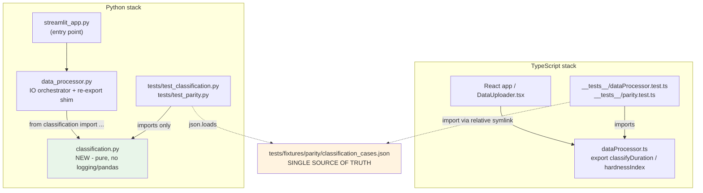
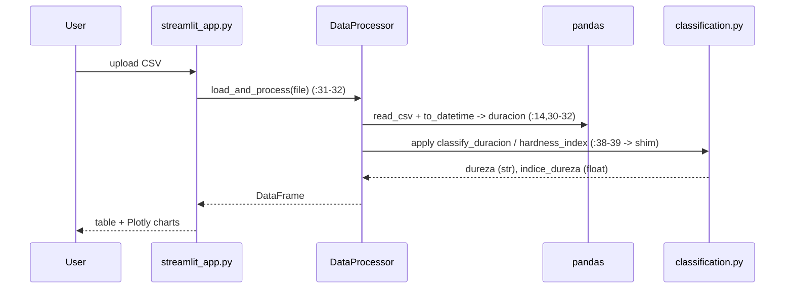
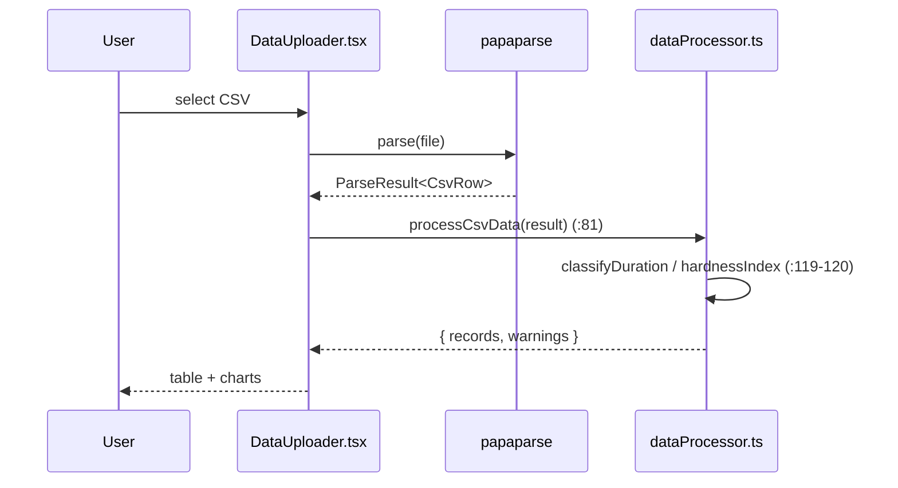

# Design: bootstrap-test-runner

**Status:** Draft
**Date:** 2026-07-10
**Change:** `bootstrap-test-runner`

## 1. Context

This design describes HOW to bootstrap a test runner per stack and a cross-stack
parity contract, without changing runtime behavior. It follows the locked scope in
[`proposal.md`](proposal.md), the findings in [`explore.md`](explore.md), and three
delta specs:

- [`specs/python-classification-and-testing/spec.md`](specs/python-classification-and-testing/spec.md)
- [`specs/typescript-classification-and-testing/spec.md`](specs/typescript-classification-and-testing/spec.md)
- [`specs/cross-stack-parity/spec.md`](specs/cross-stack-parity/spec.md)

The two stacks already implement byte-equivalent classification logic
(`data_processor.py:47-90`, `webapp/src/utils/dataProcessor.ts:38-68`). The design's
job is to make that logic *importable in a test harness* and to lock equivalence with
one shared fixture. No thresholds, formulas, or CSV parsing change here.

## 2. Goals and Non-Goals

**Goals** (restated from proposal, no expansion):

- `pytest tests/ -q` and `npm run test:run` run green locally after `pip install -r requirements-dev.txt` / `npm install`, with no other setup.
- Extract Python pure functions into `classification.py`; keep `data_processor.py` backward compatible for `streamlit_app.py:3, 31-32`.
- Export `classifyDuration` / `hardnessIndex` (`dataProcessor.ts:38, 51`) with no runtime change.
- One smoke test per stack (9 categorical + 11 continuous cases) and one parity test per stack against a single shared JSON fixture.

**Non-goals** (locked): GitHub Actions/CI, coverage thresholds, property-based testing,
end-to-end CSV parity, `app.log` cleanup, linters/formatters, deep component tests.

## 3. Architecture Overview



The pure functions are the shared contract surface. The fixture sits *between* the two
stacks: Python owns the file on disk; TypeScript reads the same bytes through a
relative symlink.

## 4. Module Boundary Decision: `classification.py` Extraction

**Why extract.** Importing `data_processor.py` runs `logging.basicConfig(filename="app.log", ...)`
at module import (`data_processor.py:5-6`), writing to disk as a side effect. Pure-function
smoke tests must not depend on that. Extracting `classify_duracion` (`data_processor.py:47-55`)
and `hardness_index` (`data_processor.py:57-90`) into a module with no `logging`/`pandas`
import gives a clean, side-effect-free import target (spec python R-1, S-1). Side benefit:
the extracted module cannot trigger the import-time logging side effect at all.

**Why `data_processor.py` re-exports.** `streamlit_app.py:3` does `from data_processor import DataProcessor`
and `streamlit_app.py:31-32` calls `DataProcessor().load_and_process(...)`, whose body at
`data_processor.py:38-39` calls `self.classify_duracion` / `self.hardness_index` via
`DataFrame.apply`. To keep that path working, `data_processor.py` adds a module-level
`from classification import classify_duracion, hardness_index` and keeps the two methods
as one-line wrappers delegating to the extracted functions (spec python R-2, S-2).

**Backward compatibility.** Public names and signatures are unchanged: the module-level
names `classify_duracion` / `hardness_index` exist, and `DataProcessor.classify_duracion(minutos)` /
`DataProcessor.hardness_index(T)` keep the same call contract. This is addition-over-modification
(api-and-interface-design): the class methods remain a public surface `streamlit_app.py`
depends on, so we preserve them rather than inlining call sites.

**Alternative considered — conftest-only patch.** Monkey-patching `logging.basicConfig`
to a no-op in `conftest.py` *without* extraction was rejected: it re-imposes the import-order
coupling the extraction removes (any test importing `data_processor` still pulls in the
side-effecting module) and is fragile if pytest ever splits import collection
(`explore.md:322-326`). The design keeps a `conftest.py` anyway — but only for the IO test
that legitimately imports `data_processor` (see Section 6).

## 5. Parity Test Strategy

| Concern | Decision | Spec |
|---|---|---|
| Source of truth | One file: `tests/fixtures/parity/classification_cases.json`, object with `cases[]`, each `{input, expected_dureza, expected_indice_dureza}`. No stack-local copy. | parity R-1 |
| TS consumption | Relative symlink at `webapp/src/utils/__tests__/fixtures/classification_cases.json` → repo-root fixture. | parity R-2 |
| Numeric equality | Float tolerance `1e-9` (Python `pytest.approx(abs=1e-9)`, TS `Math.abs(a-b) < 1e-9`); category is exact string equality. Tolerance documented in a comment in each parity test. | parity R-3 |
| Failure messages | Assertion message includes case index, input, expected, actual — reviewer locates divergence without diffing stacks. | parity R-4, S-4 |
| Sentinel integrity | TS parity test asserts a known sentinel case (`input: 0.0` → `roca suave`, `0.0`) so a broken/empty symlink fails loudly instead of an empty-array silent pass. | parity R-5 (S-5) |

**Symlink math (verified).** The symlink lives in `webapp/src/utils/__tests__/fixtures/`.
Relative symlinks resolve against the *containing directory*, so reaching repo root takes
five `../` hops:

```
fixtures/  →..→ __tests__/  →..→ utils/  →..→ src/  →..→ webapp/  →..→ <repo root>
```

Correct target:

```
../../../../../tests/fixtures/parity/classification_cases.json   (FIVE ../)
```

Spec parity R-2 mandates "five directory levels upward" — this is correct. Note: the
illustrative string in `proposal.md:147` shows only four `../`, which would resolve to
`webapp/tests/...` and break. The apply phase MUST use five levels (see Open Questions).

## 6. Sequence Diagrams (CSV ingestion + classification)

Required by `config.yaml:55`. Both stacks call the *same pure-function entry point* the
parity test targets.

**Python (Streamlit + pandas):**



**TypeScript (React + Vite; file upload, not fetch):**



**Parity hook.** The parity test on each side bypasses ingestion and calls the pure
functions directly — `classification.classify_duracion/hardness_index` (Python) and the
exported `classifyDuration/hardnessIndex` (TS) — feeding them the fixture's `input` and
asserting `expected_*`. Same entry point, same inputs, both stacks.

> Note on scope: the TS stack ingests via file upload + papaparse, not `fetch`. There is
> no HTTP fetch in the ingestion path (`dataProcessor.ts:81-139`); the diagram reflects
> the actual code.

## 7. Cross-Stack Divergence Detection

- **Where a regression surfaces.** During `sdd-verify`, both parity tests run
  (`pytest tests/test_parity.py -q` and `npm run test:run parity`). If either stack's
  formula/threshold drifts from the fixture, that stack's parity test fails.
- **Meaningful diff.** Because failure messages carry `index / input / expected / actual`
  (parity R-4), the reviewer reads which minute value diverged and what each side produced —
  no manual cross-stack diffing.
- **Legitimate vs accidental divergence.**
  - *Accidental* (bug in one stack): the fixture is unchanged, one parity test fails →
    fix the stack, re-run.
  - *Legitimate* (intended threshold/formula change): fixture governance (parity R-5)
    requires updating `classification_cases.json` in the *same* change, before merge, and
    both stacks together — so both parity tests go green on the new expected values.

## 8. Test Infrastructure Decisions

| Area | Decision | Rationale |
|---|---|---|
| pytest config | `[tool.pytest.ini_options]` in `pyproject.toml` (no `pytest.ini`): `testpaths=["tests"]`, `python_files=["test_*.py"]`, `minversion="9.0"`. | Single config home; pytest 9.x has native Python 3.14 wheels (`explore.md:55`). Spec python R-4. |
| pytest-cov | Pinned in `requirements-dev.txt` (`>=5.0`) but no `--cov-fail-under`. | Thresholds deferred to `bootstrap-ci` follow-up; smoke + parity only. |
| logging neutralization | `tests/conftest.py` autouse fixture no-ops `logging.basicConfig` before any `data_processor` import; conftest itself imports neither `data_processor` nor `classification`. | Only `test_data_processor_io.py` imports `data_processor`; pure tests stay clean. Spec python R-3, S-3. |
| Vitest | `webapp/vitest.config.ts` via `defineConfig` from `vitest/config`, reusing the existing Vite pipeline — no parallel transformer. | Same transform as `npm run dev`/`build`; avoids config drift (`explore.md:71,76`). Spec ts R-2. |
| DOM env | `happy-dom` (fallback `jsdom`). | Selection criterion: DOM support is needed for future RTL component tests; happy-dom is lighter/more modern and supports `<input type=file>`; jsdom is the drop-in fallback if a missing API is hit — only the `environment` string changes (`explore.md:73`). |

## 9. Risk Mitigations

- **pip not in PATH** (`explore.md:17,332`): apply step MUST ship a venv recipe —
  `python3 -m venv .venv && .venv/bin/pip install -r requirements-dev.txt` (`.venv/` is git-ignored).
- **Offline dev box** (`explore.md:26`): the bootstrap cannot self-verify here. Apply MUST
  verify what it can (file/symlink creation, static checks) and fail with an explicit list
  of commands the user runs on a connected machine.
- **Symlink portability on Windows**: deferred to `bootstrap-ci`; if a Windows consumer
  appears, set `git config core.symlinks true` there.
- **Pandas + Python 3.14 wheels** (`explore.md:330`): if the venv install stalls on wheel
  availability, fall back to `uv venv && uv pip install -r requirements-dev.txt`.

## 10. Alternatives Considered (ADRs)

| ADR | Options | Decision | Rationale |
|---|---|---|---|
| ADR-1 Logging isolation | (a) conftest-only patch vs (b) extract `classification.py` + conftest for IO | **(b)** | Extraction removes import-order coupling and gives a genuinely side-effect-free import target; conftest-only is fragile and keeps the coupling (`proposal.md:174`). |
| ADR-2 TS runner | Jest vs **Vitest** | **Vitest** | Reuses the Vite config → tests run through the same transform as the build; Jest adds a transformer that drifts from production (`explore.md:76`). |
| ADR-3 Parity method | Property-based (Hypothesis/fast-check) from day 1 vs **shared JSON fixture** | **JSON fixture** | ~15 finite boundary cases; JSON is one reviewable artifact with lowest effort/fastest feedback. Property-based is a named follow-up (`proposal.md:249`). |

## 11. Open Questions

1. **Symlink `../` count in the proposal.** The locked spec (parity R-2) requires FIVE
   `../` levels; `proposal.md:147` illustrates FOUR. The design uses five (verified in
   Section 5). This is a proposal illustrative-string fix for the apply phase, not a spec
   change — flagging so the apply author uses `../../../../../tests/fixtures/parity/classification_cases.json`
   and does not copy the four-level string. No spec edit required.
